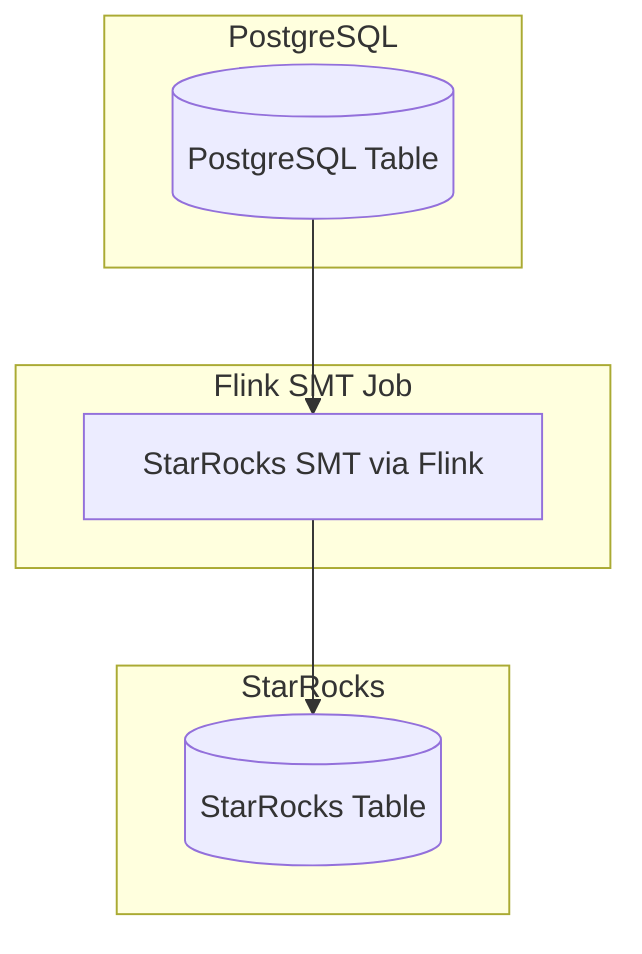

# 📡 Real-Time PostgreSQL to StarRocks Data Pipeline (Using SMT + Flink)

This repository provides a fully automated solution for **real-time synchronization** from **PostgreSQL** to **StarRocks** using [StarRocks SMT (Stream Materialized Transfer)](https://docs.starrocks.io/docs/integrations/loading_tools/SMT/) and **Apache Flink**.

It is designed to:
- Capture **Change Data Capture (CDC)** events from PostgreSQL via **logical replication**
- Stream changes in real-time using **Flink**
- Write to StarRocks with **low-latency ingestion**
- Automate schema creation and **dynamic table syncing** (CREATE + ALTER) in the destination data lake

---

## 🧱 Architecture



---

## 📦 Technologies Used

| Component     | Description |
|---------------|-------------|
| **PostgreSQL** | Source OLTP database with WAL (Write Ahead Logs) enabled |
| **Apache Flink** | Stream processing engine to read WAL changes via Debezium CDC |
| **StarRocks SMT** | Stream job runner with StarRocks native connector |
| **StarRocks** | Real-time OLAP lakehouse for fast analytics on synced data |

---

## ✅ Key Features

- 🔁 Real-time change streaming via CDC
- ⚙️ Automatic table creation and schema evolution (altering) in StarRocks
- 📥 High-performance ingestion into StarRocks via native stream connector
- 🚀 Built on StarRocks SMT + Flink (no third-party tools like Kafka or Debezium servers)
- 🔧 Fully Docker-compatible setup (Postgres, Flink, StarRocks)
- 🧪 Designed for production-scale analytical syncing

---

## 📁 Folder Structure (Recommended)

```
postgres-to-starrocks/
├── docker/
│   ├── docker-compose.yml
│   └── .env
├── sql/
│   ├── init_postgres.sql
│   ├── create_starrocks_tables.sql
├── smt/
│   ├── smt-job.json
│   └── smt.properties
├── scripts/
│   └── sync_schema.py
├── README.md
```

---

## 🚀 Setup Steps

1. ✅ **PostgreSQL Configuration** — Enable logical replication, create replication user, expose access.
2. ✅ **StarRocks Setup** — Start all-in-one StarRocks FE+BE container and create destination database.
3. ✅ **Create Target Table** — Define the destination schema in StarRocks.
4. ✅ **Configure SMT Job** — Define a Flink-compatible JSON job for SMT.
5. ✅ **Run SMT Job** — Execute the job with Flink and verify live syncing.
6. ✅ **Schema Automation** — Use a script to extract Postgres DDL and auto-create/alter StarRocks tables.
7. ✅ **Monitoring & Troubleshooting** — Check job logs, verify syncing, and handle schema drift.

---

## 🧠 Flow Summary

1. **PostgreSQL WAL** captures inserts/updates/deletes.
2. **Flink SMT job** consumes CDC stream directly from the database.
3. SMT uses the Flink runtime and StarRocks native sink to forward data.
4. Tables are created or altered automatically in StarRocks using schema introspection.
5. Data is continuously synced and queryable in StarRocks immediately.

---

## 📖 Documentation Roadmap

Each step of the process will be documented separately with:
- ✅ Full explanations
- ✅ Scripts and config files
- ✅ Query examples
- ✅ Error handling notes
- ✅ Automation instructions

To get started, proceed to Step 1 when you're ready.

---

## 📝 Author's Note

This guide is designed to help engineers deploy production-grade, low-latency data lakes from PostgreSQL into StarRocks using the most minimal and powerful tools provided by the StarRocks SMT project itself.

Feel free to extend, fork, or improve the automation components.

---

# 🧩 Step 1: PostgreSQL Configuration

This step prepares **PostgreSQL** to support **Change Data Capture (CDC)** by enabling **logical replication**, creating a replication user, and exposing the required connection ports.

We assume you’re running PostgreSQL using Docker Compose for development and testing. In production, ensure secure networking and access controls.

---

## 🔧 1.1. Enable Logical Replication in postgresql.conf

The PostgreSQL server must allow logical replication. Set the following configs in `postgresql.conf`:

```conf
# postgresql.conf
wal_level = logical
max_replication_slots = 10
max_wal_senders = 10
wal_keep_size = 128MB
```

> 💡 If you're using Docker, you'll need to mount or inject this config, or override it using `command` in `docker-compose.yml`.

---

## 👤 1.2. Create Replication User

The Flink SMT connector uses a **replication role** to access WAL logs. Run this SQL:

```sql
-- sql/init_postgres.sql
CREATE ROLE replicator WITH REPLICATION LOGIN PASSWORD 'replicator_pass';

-- Also create a test user and database (optional for dev)
CREATE DATABASE demo;
\c demo
CREATE TABLE IF NOT EXISTS users (
    id SERIAL PRIMARY KEY,
    name TEXT,
    email TEXT,
    updated_at TIMESTAMP DEFAULT NOW()
);

INSERT INTO users (name, email) VALUES ('Alice', 'alice@example.com');
```

---

## 🌐 1.3. Configure `pg_hba.conf`

Allow connections from the Flink container to access PostgreSQL. Update `pg_hba.conf`:

```conf
# pg_hba.conf
host    all             replicator      0.0.0.0/0               md5
```

> ⚠️ For production: restrict `0.0.0.0/0` to only trusted networks.

---

## 🐳 1.4. Sample docker-compose.yml for PostgreSQL

```yaml
# docker/postgres-compose.yml
version: "3.8"

services:
  postgres:
    image: postgres:15
    container_name: postgres
    ports:
      - "5432:5432"
    environment:
      POSTGRES_USER: postgres
      POSTGRES_PASSWORD: postgres
    volumes:
      - ./sql/init_postgres.sql:/docker-entrypoint-initdb.d/init.sql
      - ./postgresql.conf:/etc/postgresql/postgresql.conf
    command: ["postgres", "-c", "config_file=/etc/postgresql/postgresql.conf"]
```

---

## ✅ 1.5. Verification Checklist

After the container starts:

- ✅ PostgreSQL is accessible at `localhost:5432`
- ✅ You can log in with `psql -U postgres -h localhost`
- ✅ Table `users` exists and has test data
- ✅ Replicator user has REPLICATION privilege:
  ```bash
  psql -U postgres -c '\du'
  ```

---

## 🧪 1.6. Test Logical Decoding (Optional)

If you'd like to test decoding directly:

```sql
SELECT * FROM pg_create_logical_replication_slot('smt_slot', 'pgoutput');
```

---

## 📌 Notes

- SMT requires `pgoutput` plugin (default in modern Postgres).
- For large setups, monitor `replication slots`, WAL size, and slot cleanup.
- Make sure replication user has SELECT privileges on source tables.

---

# 🚀 Step 2: StarRocks Deployment and Table Creation

In this step, you’ll deploy StarRocks in an **all-in-one container** (Frontend + Backend) and create the destination tables where real-time data will be synced.

This will also prepare the system to support **automatic schema syncing** and **CDC ingestion** from PostgreSQL.

---

## 🐳 2.1. Start StarRocks All-in-One (Docker)

StarRocks provides an all-in-one image ideal for development and testing. Here's a minimal Docker Compose config:

```yaml
# docker/starrocks-compose.yml
version: '3.8'

services:
  starrocks:
    image: starrocks/allin1-ubuntu:latest
    container_name: starrocks
    ports:
      - "8030:8030"   # FE HTTP
      - "8040:8040"   # FE RPC
      - "9030:9030"   # MySQL Protocol Port
    environment:
      - FE_SERVERS=fe1:127.0.0.1:9010
      - BE_SERVERS=127.0.0.1:9050
    command: ["/bin/bash", "-c", "./entrypoint.sh"]
```

### ▶️ Run StarRocks:

```bash
docker compose -f docker/starrocks-compose.yml up -d
```

---

## 🖥️ 2.2. Access StarRocks Frontend (UI + CLI)

Once the container is running, test access:

- 🌐 Web UI: http://localhost:8030
- 🔗 MySQL CLI: `mysql -h127.0.0.1 -P9030 -uroot`

---

## 📦 2.3. Create StarRocks Database and Table

> If you want to automate this step in production, refer to **Step 6: Schema Automation**.

For now, you can manually create the destination database and table to match the PostgreSQL source.

```sql
-- sql/create_starrocks_tables.sql

CREATE DATABASE IF NOT EXISTS demo;

USE demo;

CREATE TABLE IF NOT EXISTS users (
    id INT,
    name STRING,
    email STRING,
    updated_at DATETIME
)
UNIQUE KEY(id)
DISTRIBUTED BY HASH(id) BUCKETS 3
PROPERTIES (
    "replication_num" = "1"
);
```

✅ Explanation:

| Field         | Purpose                                |
|---------------|----------------------------------------|
| `UNIQUE KEY`  | Ensures idempotent UPSERT from SMT     |
| `DISTRIBUTED` | StarRocks requires distribution rules  |
| `replication_num` | Number of replicas (1 = no HA)    |

---

## ✅ 2.4. Verify StarRocks Setup

Run this from CLI or UI to ensure the system is ready:

```sql
SHOW DATABASES;
USE demo;
SHOW TABLES;
DESC users;
```

If everything is correct, you should see the `users` table with the correct schema.

---

## 🧠 What Happens Here?

- StarRocks is running and ready to ingest data.
- Table schema mirrors the source Postgres table.
- The `UNIQUE KEY` setup is essential to ensure UPSERT semantics via SMT streaming.
- You can now query the StarRocks table in real-time after Flink SMT starts syncing.

---

## 🔗 Optional: Add More Tables

To sync additional tables from PostgreSQL, just repeat:

- Create equivalent StarRocks table
- Ensure matching column names and types
- Use `UNIQUE KEY` or `PRIMARY KEY`

We will later automate this via introspection (Step 6).

---

## 📌 Notes

- **The SMT job will fail** if the target table doesn’t exist unless you enable schema auto-sync (covered in a future step).
- You can use `SHOW PROC '/backends';` to check if all BE nodes are healthy.

---

# 🔄 Step 3: Define SMT Flink Job Configuration

This step sets up the **StarRocks SMT (Stream Load MultiTable)** Flink job that will **stream data in real time** from PostgreSQL to StarRocks using CDC (Change Data Capture).

We’ll configure:
- PostgreSQL CDC as a Flink source
- StarRocks sink for UPSERT operations
- Full `application.yml` config for SMT
- Environment variables
- Startup scripts

---

## 📁 3.1. Folder Structure (Recommended)

```
data-pipeline/
├── smt/
│   ├── application.yml
│   └── start.sh
```

---

## ⚙️ 3.2. SMT `application.yml` Configuration

```yaml
# smt/application.yml

job:
  id: postgres_to_starrocks
  name: Postgres to StarRocks Real-Time Sync

source:
  type: postgres-cdc
  postgres-cdc:
    hostname: postgres
    port: 5432
    username: replicator
    password: replicator_pass
    database-name: demo
    schema-name: public
    table-name: users
    slot.name: smt_slot
    plugin.name: pgoutput
    scan.startup.mode: initial  # Use "latest" for only new changes

sink:
  type: starrocks
  starrocks:
    fe-nodes: starrocks:8030
    username: root
    password: ''
    database: demo
    table: users
    label.prefix: smt_label
    sink.semantic: exactly-once
    unique-key: id
    load.properties:
      format: json
      strip_outer_array: true

schema-sync:
  enable: true
  auto-create-table: true
  ignore-incompatible-fields: false
  starrocks:
    fe-nodes: starrocks:8030
    username: root
    password: ''

flink:
  checkpoint:
    interval: 60s
  parallelism: 1
  restart-strategy: fixed-delay
  restart-attempts: 3
  delay-between-attempts: 10s
```

---

## 📝 3.3. Explanation of Key Configs

| Section                 | Description                                                                 |
|-------------------------|-----------------------------------------------------------------------------|
| `source.postgres-cdc`   | Defines the source connector (PostgreSQL CDC using Debezium)                |
| `slot.name`             | Logical replication slot name (must match what Postgres allows)             |
| `sink.starrocks`        | StarRocks sink using stream load protocol                                   |
| `label.prefix`          | Used to tag each load job                                                   |
| `schema-sync.enable`    | Allows SMT to auto-create destination table in StarRocks if missing         |
| `sink.semantic`         | Use `exactly-once` if BE version supports it                                |
| `scan.startup.mode`     | Use `initial` to load historical + realtime; `latest` for new only          |

---

## ▶️ 3.4. SMT Start Script

```bash
# smt/start.sh

#!/bin/bash
set -e

export FLINK_HOME=/opt/flink
export SMT_HOME=/opt/smt

$FLINK_HOME/bin/flink run \
  -c org.starrocks.smt.job.Main \
  $SMT_HOME/lib/smt.jar \
  --config /opt/smt/application.yml
```

> 🐳 This script assumes `smt.jar` and config files are mounted into the Flink container.

---

## 📦 3.5. SMT Docker Image (Optional)

If you're using SMT’s official image:

```bash
docker run -it --rm \
  -v $PWD/smt:/opt/smt \
  --network host \
  starrocks/smt:latest \
  /opt/smt/start.sh
```

> 🔁 You can also orchestrate SMT via Docker Compose + Flink Cluster (in a later step).

---

## ✅ 3.6. Expected Behavior

Once started:

- SMT creates a CDC pipeline between PostgreSQL and StarRocks.
- Reads WAL logs using the replication slot.
- Automatically creates the destination table (if missing).
- Performs continuous UPSERT operations to keep StarRocks in sync.

---

## 📌 Notes

- Make sure PostgreSQL logical replication is correctly configured.
- Ensure table names and schemas are matched.
- `scan.startup.mode` set to `initial` will backfill historical data.

---

# 🚀 Step 4: Deploy and Run the SMT Flink Job

In this step, you'll deploy the SMT (StarRocks Multi-Table) Flink job using the configuration you prepared in Step 3. This job will stream data from PostgreSQL to StarRocks in real time using Flink.

We’ll use:
- A standalone **Flink cluster**
- The **SMT job JAR**
- Your `application.yml` file
- Docker Compose or direct CLI (depending on your setup)

---

## 📁 4.1. Project Structure Reminder

Make sure your project has this structure:

```
data-pipeline/
├── smt/
│   ├── application.yml
│   └── start.sh
├── flink/
│   └── docker-compose.yml
```

---

## 🐳 4.2. Flink Deployment via Docker Compose

```yaml
# flink/docker-compose.yml

version: '3.8'

services:
  jobmanager:
    image: flink:1.17.1-scala_2.12
    container_name: flink-jobmanager
    ports:
      - "8081:8081"  # Flink Web UI
    environment:
      - JOB_MANAGER_RPC_ADDRESS=jobmanager
    command: jobmanager
    networks:
      - flink-net

  taskmanager:
    image: flink:1.17.1-scala_2.12
    container_name: flink-taskmanager
    depends_on:
      - jobmanager
    environment:
      - JOB_MANAGER_RPC_ADDRESS=jobmanager
    command: taskmanager
    networks:
      - flink-net

  smt-runner:
    image: starrocks/smt:latest
    container_name: smt-runner
    depends_on:
      - jobmanager
    volumes:
      - ../smt:/opt/smt
    entrypoint: ["/opt/smt/start.sh"]
    networks:
      - flink-net

networks:
  flink-net:
    driver: bridge
```

---

## ▶️ 4.3. Start Flink + SMT Job

Run the full setup:

```bash
cd flink
docker compose up -d
```

✅ This does:
- Launch Flink job & task managers
- Launch the SMT runner with your config
- Submits the SMT job to Flink automatically

---

## 🔍 4.4. Monitor the Job

Flink Web UI: [http://localhost:8081](http://localhost:8081)

There you can:
- Check logs and metrics
- Restart or stop the job
- Monitor state/checkpoints

---

## 🧪 4.5. Verify Sync is Working

Insert or update data in PostgreSQL:

```sql
-- PostgreSQL
INSERT INTO users (id, name, email, updated_at)
VALUES (1, 'Alice', 'alice@example.com', NOW());

UPDATE users SET name = 'Alice Updated' WHERE id = 1;
```

Then query StarRocks:

```sql
-- StarRocks
SELECT * FROM demo.users;
```

✅ You should see the inserted or updated record within seconds.

---

## 📦 4.6. Handle Schema Changes (Optional)

If you enabled schema syncing (`schema-sync.auto-create-table: true`), SMT will:

- Automatically create tables in StarRocks
- Add new columns if found in PostgreSQL source

⚠️ But make sure:
- Primary/Unique key is still valid
- No breaking changes (e.g. column type mismatch)

---

## 📌 Notes

| Setting                        | Description                                             |
|--------------------------------|---------------------------------------------------------|
| `flink/checkpoints`           | Keeps job fault-tolerant                                |
| `scan.startup.mode = initial` | Enables historical sync                                 |
| `smt-runner` container        | Automatically runs your job using `start.sh` script     |
| Flink JobManager UI           | Central place to monitor job state                      |

---

## ✅ Summary

You now have a real-time syncing pipeline up and running:
- 🐘 PostgreSQL as CDC source
- 🪄 Flink (via SMT) as processing engine
- 🌟 StarRocks as fast analytics sink

Next, we'll look at **automating schema creation** and enhancing the pipeline for more tables or dynamic schemas.

---

# 🏗️ Step 5: Enable and Manage Schema Auto-Creation in StarRocks

This step enables **automatic schema creation and alteration** in **StarRocks**, based on the schema definitions of your source PostgreSQL tables.

The SMT (StarRocks Multi-Table) job supports auto-creating and updating destination tables, so you won’t need to manually define tables in StarRocks.

---

## ⚙️ 5.1. Enable Schema Auto-Creation in `application.yml`

Make sure your SMT config includes the following:

```yaml
schema-sync:
  enable: true
  auto-create-table: true
  ignore-incompatible-fields: false
  starrocks:
    fe-nodes: starrocks:8030
    username: root
    password: ''
```

| Key                          | Description                                                                 |
|------------------------------|-----------------------------------------------------------------------------|
| `enable`                     | Turns on schema syncing                                                    |
| `auto-create-table`          | Enables automatic creation of missing tables                               |
| `ignore-incompatible-fields`| Whether to ignore type conflicts (set `true` with caution)                 |

---

## 🧠 5.2. How SMT Creates StarRocks Tables

SMT reads table schema from PostgreSQL and generates a **StarRocks-compatible `CREATE TABLE` statement**.

It supports:
- Primary or unique keys
- Common column types (int, string, timestamp, etc.)
- Nullable and default values
- Comments and metadata (if any)

> 💡 For each table listed under `source.table-name`, it tries to match the StarRocks table. If missing, SMT creates it.

---

## 🧪 5.3. Example: PostgreSQL Table

```sql
CREATE TABLE users (
  id SERIAL PRIMARY KEY,
  name VARCHAR(255),
  email VARCHAR(255),
  age INT,
  created_at TIMESTAMP DEFAULT now()
);
```

SMT will auto-generate and run:

```sql
CREATE TABLE IF NOT EXISTS demo.users (
  id INT,
  name VARCHAR(255),
  email VARCHAR(255),
  age INT,
  created_at DATETIME
)
UNIQUE KEY(id)
DISTRIBUTED BY HASH(id) BUCKETS 4
PROPERTIES (
  "replication_num" = "1"
);
```

> 📌 Bucket count and replication factor can be configured globally (future enhancement).

---

## 📝 5.4. Managing Schema Evolution

If you **add a new column** to PostgreSQL, like this:

```sql
ALTER TABLE users ADD COLUMN is_active BOOLEAN DEFAULT true;
```

Then SMT will **automatically ALTER** the StarRocks table:

```sql
ALTER TABLE demo.users ADD COLUMN is_active BOOLEAN;
```

✅ This works seamlessly if `schema-sync.enable` and `auto-create-table` are both `true`.

---

## 🧯 5.5. Limitations & Considerations

| Constraint                        | Notes                                                                 |
|----------------------------------|-----------------------------------------------------------------------|
| Column type mismatches           | May require manual adjustment unless `ignore-incompatible-fields: true` |
| Unique key requirement           | SMT-generated StarRocks tables use `UNIQUE KEY`. You **must** provide a `unique-key` in the config |
| Complex types / JSON             | Not all PostgreSQL types are supported (arrays, hstore, etc.)        |
| Dropping columns                 | SMT does **not** automatically drop columns for safety               |

---

## 🛠️ 5.6. Manual Overrides (Optional)

If you want more control:
- You can disable `auto-create-table`
- Manually create tables in StarRocks using compatible DDL
- Or pre-generate the DDL with SMT tools (coming soon)

---

## ✅ 5.7. Summary

With schema sync enabled:
- ✅ SMT automatically creates tables in StarRocks if they don’t exist
- ✅ SMT keeps schemas in sync (adds new columns)
- 🔒 You retain control over primary key definitions via `unique-key` setting

This makes your pipeline **schema-aware**, **resilient**, and **hands-off** for new tables.

---

# 🧩 Step 6: Add More Tables to the Sync Pipeline (Optional, Scalable Design)

This step shows you how to **scale** your real-time syncing pipeline by adding **multiple PostgreSQL tables** to the SMT (StarRocks Multi-Table) job. SMT supports syncing hundreds of tables **in parallel** from the same or different databases.

---

## 🧰 6.1. Add Tables in `application.yml`

To sync multiple tables, simply list them in the `source.table-name` field under the `source` config:

```yaml
source:
  table-name:
    - public.users
    - public.orders
    - public.products
```

> ✔️ Each table will have a corresponding destination table auto-created in StarRocks.

You can also use *wildcards* or regex-like syntax if supported by your connector. For example:

```yaml
source:
  table-name:
    - public.*
```

> 🔁 This syncs **all tables** in the `public` schema.

---

## 📄 6.2. Table-Specific Configuration

If different tables require different configurations (e.g., unique keys), you can define them like this:

```yaml
tables:
  public.users:
    unique-key: id
  public.orders:
    unique-key: order_id
  public.products:
    unique-key: product_id
```

SMT will use these configs when auto-generating DDLs for StarRocks.

---

## 📊 6.3. Example: Three Tables in Sync

**PostgreSQL Tables:**

```sql
CREATE TABLE users (
  id SERIAL PRIMARY KEY,
  name VARCHAR(100)
);

CREATE TABLE orders (
  order_id UUID PRIMARY KEY,
  user_id INT,
  total NUMERIC
);

CREATE TABLE products (
  product_id TEXT PRIMARY KEY,
  name TEXT,
  price NUMERIC
);
```

**StarRocks Tables (Auto-Generated by SMT):**

```sql
CREATE TABLE demo.users (
  id INT,
  name VARCHAR(100)
) UNIQUE KEY(id) DISTRIBUTED BY HASH(id) BUCKETS 4;

CREATE TABLE demo.orders (
  order_id STRING,
  user_id INT,
  total DECIMAL(18,2)
) UNIQUE KEY(order_id) DISTRIBUTED BY HASH(order_id) BUCKETS 4;

CREATE TABLE demo.products (
  product_id STRING,
  name STRING,
  price DECIMAL(18,2)
) UNIQUE KEY(product_id) DISTRIBUTED BY HASH(product_id) BUCKETS 4;
```

---

## ⚙️ 6.4. Deployment and Restart

Once new tables are added:
1. Update your `application.yml`
2. Restart the SMT Flink job:

```bash
# Stop the current job (if needed)
./bin/stop.sh

# Re-deploy with updated config
./bin/start.sh
```

SMT will detect the new tables and begin syncing them immediately.

---

## 🧠 6.5. Best Practices for Scaling

| Practice                     | Description                                                                 |
|-----------------------------|-----------------------------------------------------------------------------|
| Use clear naming            | Always namespace tables like `schema.table`                                |
| Avoid massive schema loads  | Don’t start with too many tables at once — stagger if needed               |
| Monitor Flink metrics       | Use Flink dashboard to watch throughput, lag, and task health              |
| Use `unique-key` per table  | Prevent accidental overwrites in StarRocks                                 |
| Enable schema sync          | So new columns are automatically handled                                   |

---

## 🛡️ 6.6. Table Conflict Management

If a StarRocks table already exists, and differs in structure:
- SMT will skip it and log a **schema mismatch error**.
- To fix, either:
  - Align schemas manually, or
  - Delete the StarRocks table to allow auto-recreation

---

## ✅ 6.7. Summary

- ✅ Easily add new tables to the sync pipeline
- ⚙️ SMT handles table creation and stream ingestion automatically
- 🔁 All tables run in parallel for scalable and efficient loading

This unlocks **full-database replication** into your **StarRocks real-time lakehouse**.

---

# 🔍 Step 7: Monitor, Debug, and Maintain the Pipeline

Monitoring and maintaining your real-time data pipeline is **crucial** for stability, performance, and correctness. In this step, you'll learn how to **observe**, **debug**, and **tune** the SMT + Flink + StarRocks syncing stack.

---

## 🖥️ 7.1. Monitor Flink Web UI

When SMT runs as a Flink job, it exposes a **web dashboard** (usually at `http://localhost:8081`) where you can:

- ✅ See job graph and task statuses
- 📈 View throughput and latency
- 🧩 Check backpressure and checkpointing
- 🚨 Inspect failure logs and restarts

> 💡 Use this dashboard to **quickly spot stalls or dropped tables**.

---

## 🧾 7.2. View SMT Logs

All logging output from SMT is visible via Docker logs or Flink logs:

```bash
docker logs -f starrocks-smt-job
# or, if running in Flink:
docker logs -f flink-taskmanager
```

Look out for:

| Message Example                                | Meaning                                      |
|------------------------------------------------|----------------------------------------------|
| `Created table demo.users`                     | Auto-table creation worked                   |
| `Incompatible type for column 'price'`         | Schema mismatch, check field config          |
| `Table demo.orders not found`                  | Might be delay in PostgreSQL connector       |
| `Error writing to StarRocks: timeout`          | StarRocks unreachable — check ports          |

---

## 🧪 7.3. Verify Data in StarRocks

You can use **StarRocks web UI** or **MySQL client** to connect and query the synced data:

```bash
mysql -h 127.0.0.1 -P 9030 -u root
```

Query example:

```sql
SELECT COUNT(*) FROM demo.users;
SELECT * FROM demo.orders ORDER BY created_at DESC LIMIT 10;
```

Make sure data is being **updated live** from PostgreSQL changes.

---

## 🛠️ 7.4. Restart the Job (If Needed)

If configuration changes or job restarts are needed:

```bash
# Stop the Flink job or docker container
./bin/stop.sh

# Apply config changes in application.yml

# Start again
./bin/start.sh
```

> 🔁 SMT picks up where it left off thanks to **Debezium + Flink checkpoints**.

---

## 🧯 7.5. Common Troubleshooting Issues

| Problem                                | Solution                                                  |
|----------------------------------------|-----------------------------------------------------------|
| StarRocks port (9030) unreachable      | Make sure it's mapped and container is running            |
| Flink UI not accessible                | Check if Flink job manager port 8081 is exposed           |
| Table exists but schema mismatched     | Drop table manually or fix schema in PostgreSQL           |
| Data not flowing                       | Confirm Debezium connector is capturing events            |
| Auto table creation not working        | Ensure `schema-sync.enable` and `auto-create-table` are `true` |
| SMT job crashes                        | Check logs for cause (usually schema or network)          |

---

## 📊 7.6. Metrics You Should Monitor

| Metric                            | Description                                               |
|----------------------------------|-----------------------------------------------------------|
| Rows processed per second        | Throughput                                                |
| Lag behind source (PostgreSQL)   | Delay in applying changes                                 |
| Number of active tasks           | Should match parallelism                                  |
| Failed checkpoints / task restarts | Indicates stability problems                             |

> ✅ Set up alerting based on these metrics if running in production.

---

## 🧹 7.7. Long-Term Maintenance

- Periodically clean **old checkpoint directories** if not using state save
- Back up your `application.yml` and logs
- Upgrade SMT/StarRocks/Flink versions for new features and fixes
- Add validation queries to confirm sync correctness

---

## ✅ 7.8. Summary

You now have visibility into your pipeline and tools to:
- Monitor sync status in real time
- Debug schema or connection issues
- Maintain job performance and integrity over time

A reliable pipeline = a **trustworthy real-time analytics platform**.

---

# 🧱 Step 8: Optional Enhancements (Compression, Parallelism, Partitioning)

This step walks through **performance tuning and scalability enhancements** for your SMT + Flink + StarRocks pipeline.

These optimizations are **optional** but highly recommended for production environments or high-throughput use cases.

---

## 🚀 8.1. Increase Parallelism

By default, SMT runs with `parallelism = 1`, which limits how many tables or records can be processed at once.

To scale up:

### 🔧 Set Parallelism in `application.yml`:

```yaml
pipeline:
  parallelism: 4
```

This allows Flink to spawn **4 parallel processing tasks**.

> 🧠 Best practice: Match this to the number of CPU cores in your Flink TaskManager.

---

## 📦 8.2. Enable Compression

Use **LZ4** or **ZSTD** compression for better throughput between Flink and StarRocks.

### ✍️ In `application.yml`:

```yaml
sink:
  compress-type: LZ4
```

Available types: `NO_COMPRESSION`, `LZ4`, `ZSTD`

> 🗜️ Compression reduces network I/O and speeds up ingestion into StarRocks.

---

## 📅 8.3. Use StarRocks Table Partitioning

To improve query performance on large StarRocks tables, use **range partitioning** (especially for time-based data).

Auto-partitioning isn't supported directly by SMT — but you can **manually pre-create** a partitioned table, then SMT will sync into it.

### 🛠️ Example:

```sql
CREATE TABLE demo.orders (
  order_id STRING,
  user_id INT,
  total DECIMAL(18,2),
  created_at DATETIME
)
UNIQUE KEY(order_id)
PARTITION BY RANGE(`created_at`) (
  PARTITION p2024 VALUES LESS THAN ("2025-01-01"),
  PARTITION p2025 VALUES LESS THAN ("2026-01-01")
)
DISTRIBUTED BY HASH(order_id) BUCKETS 8;
```

Then remove the table from `auto-create` scope and let SMT ingest into it.

---

## 🔃 8.4. Optimize Debezium Source Connector

To reduce lag or snapshot time for large databases, consider tuning these:

```yaml
source:
  startup-mode: latest-offset     # Or 'earliest-offset' or 'initial'
  snapshot:
    mode: never                   # Skip initial snapshot if not needed
  poll-interval-ms: 500           # Reduce delay between polling batches
```

> ⚠️ Only use `snapshot.mode: never` if you don’t care about past data.

---

## 🗃️ 8.5. StarRocks Storage Optimizations

Enable **colocation**, **short key optimizations**, or **tablet compaction** for large fact tables:

```sql
ALTER TABLE demo.orders SET ("enable_light_schema_change" = "true");
```

Consult StarRocks [performance tuning docs](https://docs.starrocks.io/docs/administration/Optimizing_table_design/) for more.

---

## 🧪 8.6. Benchmarking Performance

Run benchmark tests to measure:

| Metric             | Target |
|--------------------|--------|
| Insert latency     | < 500 ms for most events |
| Sync lag           | < 5 seconds |
| Flink CPU usage    | < 70% under load |
| Network I/O        | Monitor compression effect |
| StarRocks queries  | Test latency with `EXPLAIN` |

Use `flink-ui`, `grafana`, or `StarRocks profile` to gather metrics.

---

## ✅ 8.7. Summary of Enhancements

| Enhancement       | Benefit                                      |
|------------------|----------------------------------------------|
| Parallelism       | Faster sync, scales across CPUs              |
| Compression       | Reduced I/O and faster delivery              |
| Partitioning      | Better query and ingestion performance       |
| Debezium tuning   | Lower lag, faster startup                    |
| Table design opts | Faster writes and compactions                |

---

## 🧭 Final Note

Your pipeline is now:
- ✅ Real-time
- ✅ Scalable
- ✅ Auto-managed
- ✅ Production-ready

You’ve built a **low-latency lakehouse architecture** from PostgreSQL to StarRocks using only Flink + SMT.
